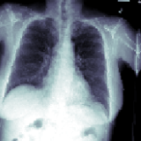
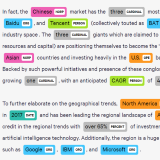

# Aprendizado federado no Azure ML

Federated Learning (FL) é uma estrutura em que se treina um único modelo ML em conjuntos de dados distintos que não podem ser coletados em um único local central. Isso permite que empresas e instituições cumpram os regulamentos relacionados à localização e acesso de dados, permitindo inovação e personalização.

Este repositório fornece alguns exemplos de código para executar um pipeline de aprendizado federado na plataforma Azure Machine Learning.

:warning: A execução de um pipeline de aprendizado federado completo levanta **questões de segurança que você precisa abordar** antes de usar este repositório para fins de produção. Considere este repositório apenas como uma amostra.

## Índice

- [Getting started](#zap-getting-started)
- [Documentation](#documentation)
- [Support](#need-support)
- [Contributing](#contributing)

### :zap: Começando

Sem tempo para ler? Acesse diretamente o [**início rápido**](./docs/quickstart.md) para provisionar uma demonstração em minutos em sua própria assinatura.

### Exemplos do mundo real

Verifique também nossos casos de uso do setor abaixo.

| Medical Imaging | Named Entity Recognition | Fraud Detection |
| :-: | :-: | :-: |
|  |  |  |
| [pneumonia.md](./docs/real-world-examples/pneumonia.md) | [ner.md](./docs/real-world-examples/ner.md) | [ccfraud.md](./docs/real-world-examples/ccfraud.md) |

### Documentação

Please find a full documentation of this project [**here**](docs/README.md).

### Need Support?

Please check the [**troubleshooting guide**](./docs/tsg.md) for possible solutions. If you are unable to find a solution, please open an issue in this repository.

If you have any feature requests, technical questions, or find any bugs, please do not hesitate to reach out to us.

For bug reports and feature requests, you are welcome to open an [**issue**](https://github.com/Azure-Samples/azure-ml-federated-learning/issues).

### Contributing

This project welcomes contributions and suggestions. Most contributions require you to agree to a Contributor License Agreement (CLA) declaring that you have the right to, and actually do, grant us the rights to use your contribution. For details, visit https://cla.opensource.microsoft.com.

To contribute, please start by creating a self-assigned [**issue**](https://github.com/Azure-Samples/azure-ml-federated-learning/issues/new) giving a high-level overview of what you'd like to do. Once any discussion there concludes, follow up with a PR.

Please send an email to aims-team@microsoft.com to request a "contributor" access to this repository, if you have difficulty in creating a branch. When you submit a pull request, a CLA bot will automatically determine whether you need to provide a CLA and decorate the PR appropriately (e.g., status check, comment). Simply follow the instructions provided by the bot. You will only need to do this once across all repos using our CLA.

This project has adopted the Microsoft Open Source Code of Conduct. For more information see the Code of Conduct FAQ or contact opencode@microsoft.com with any additional questions or comments.
